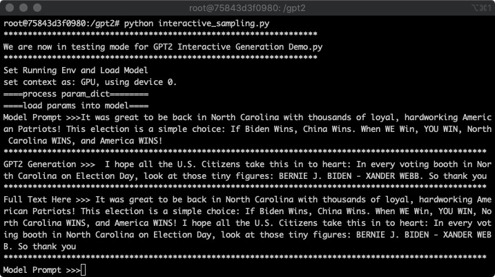
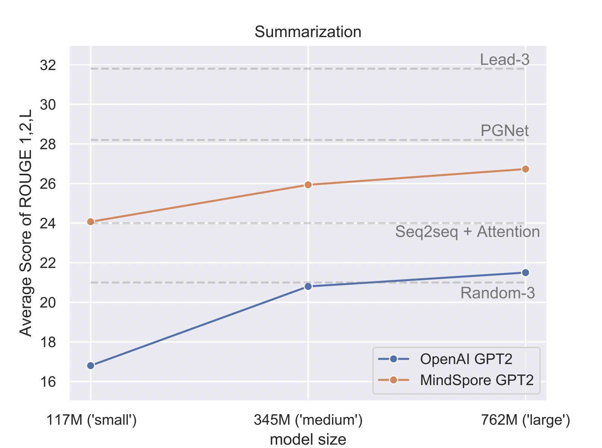

# MindSpore-GPT2

## Declaration

This is an early version of Minsdpore GPT2. The final version will be merged to MindSpore's ModelZoo. 

MindSpore GPT2 has been merged to master branch of MindSpore's official repo. [Link](https://gitee.com/mindspore/models/tree/master/research/nlp/gpt2)

The official link of MindSpore ModelZoo: [Link](https://gitee.com/mindspore/models)

~~You can find our unmerged official MindSpore ModelZoo commit here: [Link](https://gitee.com/mindspore/mindspore/tree/f5cb27b21e40292ebd0d7b8afbe32a02acd13ae1/model_zoo/research/nlp/gpt2) [Full Repo](https://gitee.com/ouyang_xx/mindspore/tree/master/model_zoo/research/nlp/gpt2)~~

~~Once it is merged to master branch of MindSpore repository, the official link is here: [Link](https://gitee.com/mindspore/mindspore/tree/master/model_zoo/research/nlp/gpt2)~~

## In Brief

An implementation of GPT2 with MindSpore from scratch.<br>OpenAI's original paper: A Radford, J Wu, R Child, D Luan, D Amodei, Ilya Sutskever "Language Models are Unsupervised Multitask Learners" [Link](https://github.com/mindspore-ai/mindspore/tree/master/model_zoo/official/nlp) 

## Download a Mindspore-GPT2 pretrained model

The model is a '.ckpt' file and has 3 different sizes. You should use a mindspore function 'load_checkpoint' to load the parameters  <br>
Download link: https://pan.baidu.com/s/1WZ0rZ0qafkUvEOScoN21YQ <br>
Download key: 1895 <br>

## Generation Demo

### usage

#### Download official image of MindSpore

Use docker to pull official MindSpore GPU image (tag: 1.0.1 is recommended for this repo)

```sh
docker pull mindspore/mindspore-gpu:1.0.1
```

You can run a Nvidia-docker2 container and link this repo to the file system of the container.

#### Run python file

```sh
python interactive_sampling.py
```




## Summary Task

Performance on CNN-Dailymail (version 3.0.0)



#####  Results on Test set

| Model  | Device | Dataset Size | Finetune Rouge | OpenAI Rouge |
| :----: | :----: | :----------: | :------------: | :----------: |
| small  | Ascend |    11490     |     24.07      |     16.8     |
| medium | Ascend |    11490     |     25.94      |     20.6     |
| large  | Ascend |    11490     |     26.81      |     21.5     |

##### Comparison to OpenAI's GPT2 (TensorFlow)

|         Model         |  Rouge-1  |  Rouge-2  |  Rouge-L  | Rouge-AVG |
| :-------------------: | :-------: | :-------: | :-------: | :-------: |
|  OpenAI GPT2 XLarge   |   29.34   |   8.27    |   26.58   |   21.40   |
| MindSpore GPT2 small  |   30.51   |   11.37   |   30.32   |   24.07   |
| MindSpore GPT2 medium | **32.84** | **12.82** | **32.14** | **25.94** |

